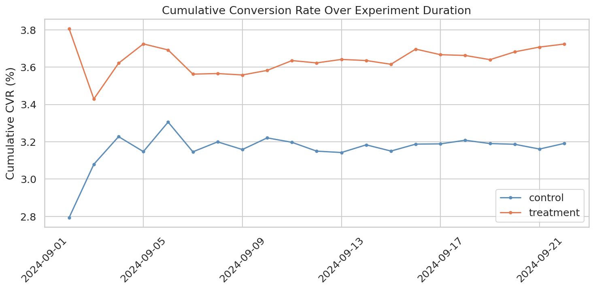
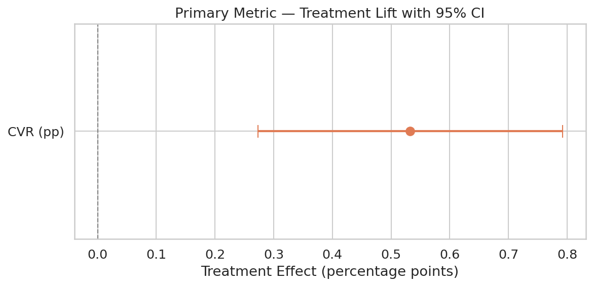
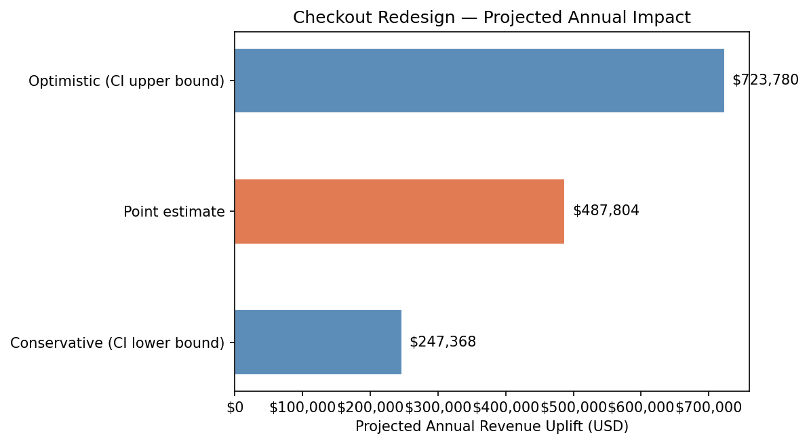

# A/B Test: E-Commerce Checkout Redesign

End to end A/B testing project, from experiment design through statistical analysis to a ship/no-ship business recommendation.



---

## Business Context

A mid-size e-commerce retailer (~3,600 sessions/day) tested a **one page checkout** against its old multi-step checkout process. The hypothesis: reducing friction in the purchase funnel would increase the checkout conversion rate without lowering the average order value.

### Hypotheses
A **Two-Sided Hypothesis Test** was applied  to maintain statistical rigor and conservatively control the error rate.

- **H₀ (Null):** $CVR_{treatment} = CVR_{control}$
- **H₁ (Alternative):** $CVR_{treatment} \neq CVR_{control}$

**Decision Framework:**
1. **Significance:** We reject $H_0$ only if $p < 0.05$.
 2. **Improvement:** If $H_0$ is rejected, the new design will only be implemented if proven significant and positive.
3. **Guardrails:** The new one checkout wont be implemented if (AOV) show a statistically significant decline, even if CVR increases.
   
### KPIs
| Metric | Role | Why |
|---|---|---|
| Checkout conversion rate | Primary | Measures if users cumplete the purchasing process |
| Revenue per session | Secondary | Captures both conversion and order value changes |
| Average order value | Guardrail | Ensures avarage order value do not decrease |

---

## Methodology

### Experiment Design

| Parameter | Value | Rationale |
|---|---|---|
| Randomisation unit | User session (cookie) | Standard for web experiments, avoids cross device leakage |
| Split | 50/50 | Maximises statistical power |
| Duration | 21 days | Covers 3 full weekly cycles to account for day of week effects |
| MDE | 0.4 pp (~12.5% relative) | Business meaningful lift, achievable with 30K sessions/group |
| α | 0.05 (two-sided) | Industry standard |
| Power | 0.80 | Standard: 21day run yields >37K per group, exceeding the requirement |

### Risks Addressed

- **Sample Ratio Mismatch (SRM):** Chi-squared test confirms balanced assignment (p = 0.017 > 0.01 threshold).
- **Novelty effect:** Compared first week vs last week conversion rates: treatment lift persists and slightly grows.
- **Multiple comparisons:** Bonferroni correction applied across 3 hypothesis tests.
- **Peeking:** Analysis run only after the pre-committed 21-day window; no interim looks.

### Dataset

Synthetic data generated with realistic patterns: day of week seasonality, device mix, traffic source variation, and a fading novelty bump. See `notebooks/01_generate_data.py` for the full generative model and all parameters.

**76,173 sessions** over 21 days (38416 control / 37757 treatment).

---

## Results

### Primary Metric — Conversion Rate

| | Control | Treatment |
|---|---|---|
| Sessions | 38,416 | 37,757 |
| Conversions | 1,226 | 1,406 |
| CVR | 3.19% | 3.72% |

- **Absolute lift:** +0.53 pp
- **Relative lift:** +16.7%
- **95% CI:** [+0.27 pp, +0.79 pp]
- **p-value:** 0.00006
- **Cohen's h:** 0.029 (small but practically significant at this scale)



### Secondary Metrics

- **Revenue per session:** +$0.32 (bootstrap 95% CI: [$0.12, $0.51])
- **AOV:** No significant change (p = 0.23) — the revenue uplift comes from higher conversion volume, not larger baskets.

### Robustness

- Permutation test confirms: p = 0.0001.
- Lift is positive and consistent across desktop (+0.67 pp) and mobile (+0.71 pp).
- Tablet segment shows a negative signal, but the sample is small and noisy.

---

## Business Impact



| Scenario | Annual Extra Conversions | Revenue Uplift |
|---|---|---|
| Conservative (CI lower bound) | 3,575 | $247K |
| Point estimate | 7,049 | $488K |
| Optimistic (CI upper bound) | 10,459 | $724K |

---

## Recommendation

### 🟢 Ship the new checkout

The treatment produces a clear, statistically robust improvement in the primary KPI. The effect is consistent across the two largest device segments (desktop + mobile = 87% of traffic), stable over time, and translates directly into incremental revenue.

**Follow-up actions:**
1. Roll out to 100% with a 5% holdback for post-launch validation.
2. Investigate the tablet segment for a device-specific UX follow-up test.
3. Instrument funnel-step tracking in the new flow for micro-optimisation.

---

## Repository Structure

```
├── README.md                          # This file
├── requirements.txt                   # Python dependencies
├── data/
│   └── ab_test_data.csv               # Generated experiment data (76K rows)
├── notebooks/
│   ├── 01_generate_data.py            # Synthetic data generation
│   ├── 02_eda.py                      # Exploratory data analysis
│   ├── 03_statistical_analysis.py     # Hypothesis testing & robustness
│   └── 04_business_recommendations.py # Impact sizing & recommendation
├── src/
│   ├── stats_utils.py                 # Reusable statistical functions
│   └── data_utils.py                  # Data loading & validation
├── powerbi/
│   └── dashboard_design.md            # Data model, DAX, and layout spec
├── reports/
│   └── executive_summary.md           # Stakeholder-ready summary
├── assets/                            # Charts generated by analysis scripts
└── rubric/
    └── self_assessment.md             # Self-grading against hiring rubric
```

## Reproducibility

```bash
git clone <repo-url>
cd ab-test-checkout-redesign
pip install -r requirements.txt

# Generate data
python notebooks/01_generate_data.py

# Run analysis (in order)
python notebooks/02_eda.py
python notebooks/03_statistical_analysis.py
python notebooks/04_business_recommendations.py
```

All random seeds are fixed. Outputs are deterministic.

---

## Tools & Libraries

Python 3.11+ · pandas · NumPy · SciPy · statsmodels · matplotlib · seaborn · Power BI
